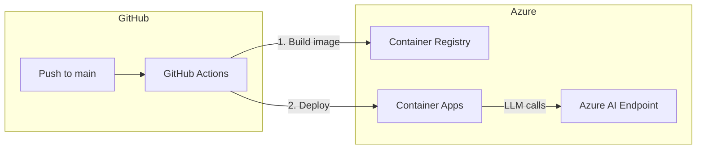

# CI/CD and Azure Infrastructure Plan

## Architecture



## Files to Create

| File | Purpose |
|------|---------|
| `.github/workflows/deploy.yml` | CI/CD workflow triggered on push to main |
| `infra/main.tf` | All Terraform resources in one file |
| `infra/.terraform.lock.hcl` | (auto-generated by terraform init) |

## 1. GitHub Actions Workflow

**File: `.github/workflows/deploy.yml`**

Triggers on push to `main` only (no PR). Two jobs:
1. **test** — install deps, run pytest
2. **deploy** — build Docker image, push to ACR, update Container App

Key features:
- Uses `az acr build` (builds in Azure, no local Docker needed)
- Tags images with both `latest` and git SHA for rollback
- Only deploys if tests pass (`needs: test`)

Required GitHub secrets:
- `AZURE_CREDENTIALS` — service principal JSON for `az login`
- `AZURE_AI_API_KEY` — your Azure AI key (passed to Terraform)

## 2. Terraform Configuration

**File: `infra/main.tf`**

Single file containing:
- Provider config (azurerm ~> 3.100)
- Variables block (location, API endpoint, API key)
- Resource group
- Container Registry (Basic SKU, admin enabled)
- Container Apps Environment
- Container App with:
  - Image from ACR
  - Environment variables matching your `.env`:
    - `FEWS_AGENT_PROVIDER=litellm`
    - `AZURE_AI_API_BASE` (from variable)
    - `AZURE_AI_API_KEY` (from secret)
    - `FEWS_AGENT_MODEL=azure_ai/Llama-3.3-70B-Instruct`
  - Ingress on port 8501 (external)
  - Scale 0-2 replicas (cost-efficient)
- Outputs: app URL, ACR login server

**File: `infra/terraform.tfvars.example`**

Template showing required variables (actual `.tfvars` is gitignored).

## 3. Updates to Existing Files

**File: [.gitignore](.gitignore)**

Add Terraform ignores:
```
# Terraform
*.tfstate
*.tfstate.*
.terraform/
*.tfvars
!*.tfvars.example
```

## Deployment Flow

First-time setup (manual, one-time):
```bash
cd infra
terraform init
terraform apply
```

Then every push to main:
1. GitHub Actions runs tests
2. Builds and pushes image to ACR
3. Updates Container App to new image

## GitHub Secrets Setup

Create a service principal and store its output as `AZURE_CREDENTIALS`:
```bash
az ad sp create-for-rbac \
  --name "fews-agent-github" \
  --role contributor \
  --scopes /subscriptions/<subscription-id> \
  --sdk-auth
```

Store `AZURE_AI_API_KEY` separately (the value from your `.env`).
